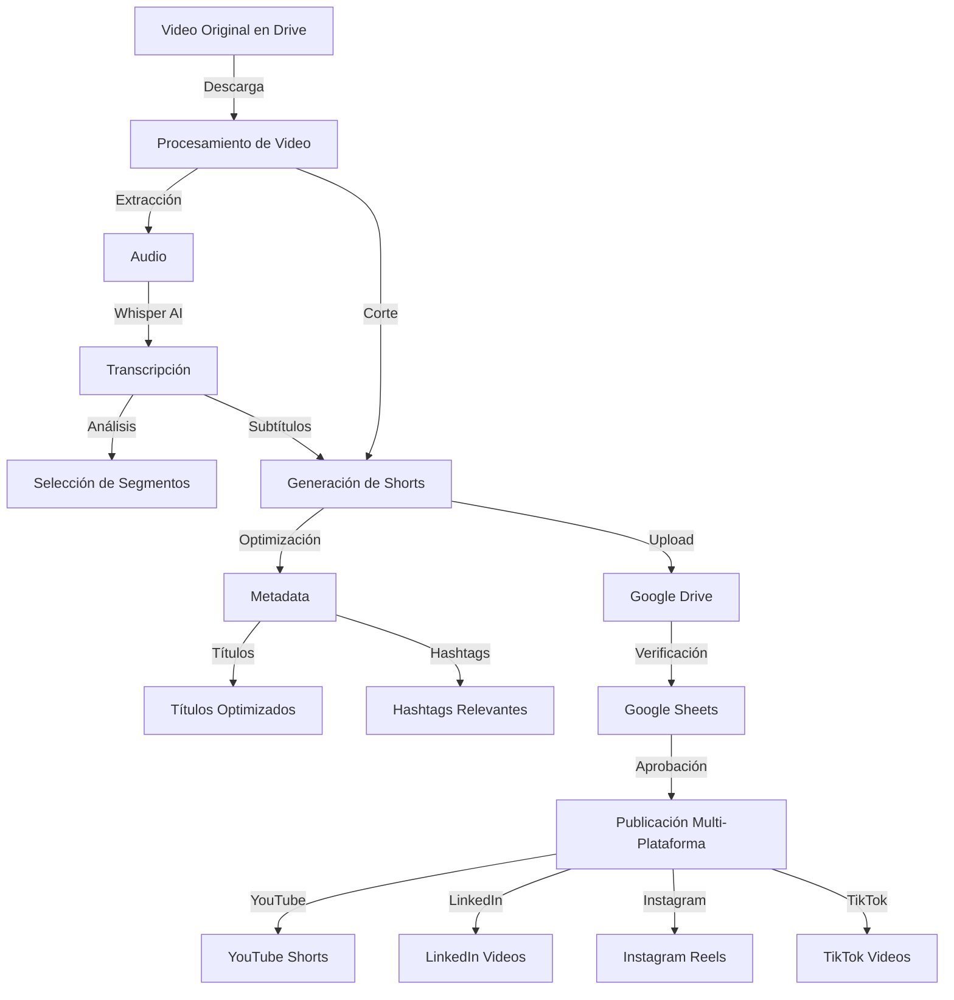

# 🎥 YouTube Shorts Creator & Social Media Publisher

Sistema automatizado para crear y publicar contenido en múltiples plataformas sociales a partir de videos largos.

## 📊 Diagrama de Flujo



## 🌟 Características

- ✂️ **Corte Inteligente**: Divide videos largos en shorts optimizados
- 🎯 **Transcripción Automática**: Usando Whisper AI
- 📝 **Generación de Subtítulos**: Integrados en el video
- 🔍 **Optimización SEO**: Títulos y hashtags optimizados
- 📊 **Gestión en Sheets**: Control y aprobación de contenido
- 🚀 **Multi-Plataforma**: Publica en:
  - YouTube Shorts
  - LinkedIn
  - Instagram Reels
  - TikTok

## 🛠️ Requisitos

1. **Python 3.8+**
2. **Credenciales**:
   - Google Service Account (Drive, Sheets, YouTube)
   - Instagram credentials
   - LinkedIn API token
   - TikTok session ID

3. **Dependencias**:
   ```bash
   pip install -r requirements.txt
   ```

## ⚙️ Configuración

1. **Variables de Entorno** (.env):
   ```env
   OPENAI_API_KEY="tu_api_key"
   YOUTUBE_API_KEY="tu_api_key"
   INSTAGRAM_USERNAME="tu_usuario"
   INSTAGRAM_PASSWORD="tu_contraseña"
   LINKEDIN_ACCESS_TOKEN="tu_token"
   ```

2. **Google Service Account**:
   - Coloca el archivo `river-surf-452722-t6-d6bacb04e3e9.json` en el directorio raíz

3. **Google Sheet**:
   - Crea una hoja con las columnas:
     - Date
     - Link
     - Título sugerido
     - Hashtags
     - Original Text
     - Approve
     - Fecha de publicación

## 🚀 Uso

1. **Ejecutar el script**:
   ```bash
   python publish_shorts.py
   ```

2. **Flujo de trabajo**:
   - Sube tu video largo a Google Drive
   - El sistema procesa el video y genera shorts
   - Revisa y aprueba en Google Sheets
   - El sistema publica automáticamente los aprobados

## 📁 Estructura de Directorios

```
automate_scripts/
├── publish_shorts.py
├── requirements.txt
├── .env
├── river-surf-452722-t6-d6bacb04e3e9.json
├── audio_transcription/
└── shorts_output/
```

## 🔄 Proceso Automático

1. **Procesamiento**:
   - Descarga video de Drive
   - Extrae audio
   - Genera transcripción
   - Crea shorts con subtítulos

2. **Optimización**:
   - Genera títulos atractivos
   - Crea hashtags relevantes
   - Optimiza metadata

3. **Publicación**:
   - Verifica aprobaciones en Sheets
   - Publica en plataformas configuradas
   - Actualiza estado en Sheets

## ⚠️ Notas Importantes

- Los directorios de trabajo se limpian automáticamente después de cada ejecución
- Se requieren permisos adecuados en todas las APIs
- Verifica los límites de tamaño y duración para cada plataforma

## 📝 Logs

El sistema mantiene un registro detallado de:
- Descargas de videos
- Procesamiento de contenido
- Publicaciones exitosas/fallidas
- Limpieza de directorios 