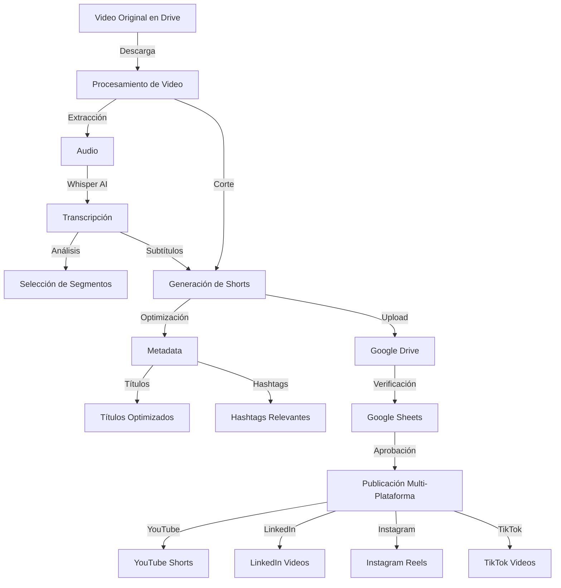

# 🎥 YouTube Shorts Creator & Social Media Publisher

Sistema automatizado para crear y publicar contenido en múltiples plataformas sociales a partir de videos largos.

## 🔒 Seguridad Importante

⚠️ **NUNCA subas las credenciales a GitHub o cualquier repositorio público** ⚠️

1. **Archivos Protegidos** (no subir a git):
   - `service_account.json` (cuenta de servicio)
   - `.env` (variables de entorno)
   - Cualquier archivo con credenciales

2. **Verificación de Seguridad**:
   ```bash
   # Verifica que tus credenciales están en .gitignore
   cat .gitignore | grep "service_account.json"
   
   # Verifica que no estás rastreando el archivo
   git status | grep "service_account.json"
   ```

## 📊 Diagrama de Flujo



## 🌟 Características

- ✂️ **Corte Inteligente**: Divide videos largos en shorts optimizados
- 🎯 **Transcripción Automática**: Usando Whisper AI
- 📝 **Generación de Subtítulos**: Integrados en el video
- 🔍 **Optimización SEO**: Títulos y hashtags optimizados
- 📊 **Gestión en Sheets**: Control y aprobación de contenido
- 🚀 **Multi-Plataforma**: Publica en:
  - YouTube Shorts
  - LinkedIn
  - Instagram Reels
  - TikTok

## 🛠️ Requisitos

1. **Python 3.8+**
2. **Credenciales**:
   - Google Service Account (Drive, Sheets, YouTube)
   - Instagram credentials
   - LinkedIn API token
   - TikTok session ID

3. **Dependencias**:
   ```bash
   pip install -r requirements.txt
   ```

## ⚙️ Configuración

1. **Cuenta de Servicio**:
   - Guarda `service_account.json` en el directorio raíz
   - ⚠️ Asegúrate de que este archivo está en `.gitignore`
   - NUNCA compartas o subas este archivo

2. **Variables de Entorno**:
   - Crea un archivo `.env` basado en `.env.example`
   - ⚠️ No subas el archivo `.env` a git
   ```env
   OPENAI_API_KEY="tu_api_key"
   YOUTUBE_API_KEY="tu_api_key"
   INSTAGRAM_USERNAME="tu_usuario"
   INSTAGRAM_PASSWORD="tu_contraseña"
   LINKEDIN_ACCESS_TOKEN="tu_token"
   ```

## 🚀 Uso

1. **Ejecutar el script**:
   ```bash
   python publish_shorts.py
   ```

2. **Flujo de trabajo**:
   - Sube tu video largo a Google Drive
   - El sistema procesa el video y genera shorts
   - Revisa y aprueba en Google Sheets
   - El sistema publica automáticamente los aprobados

## 📁 Estructura de Directorios

```
automate_scripts/
├── publish_shorts.py
├── requirements.txt
├── .env
├── service_account.json
├── audio_transcription/
└── shorts_output/
```

## 🔄 Proceso Automático

1. **Procesamiento**:
   - Descarga video de Drive
   - Extrae audio
   - Genera transcripción
   - Crea shorts con subtítulos

2. **Optimización**:
   - Genera títulos atractivos
   - Crea hashtags relevantes
   - Optimiza metadata

3. **Publicación**:
   - Verifica aprobaciones en Sheets
   - Publica en plataformas configuradas
   - Actualiza estado en Sheets

## ⚠️ Notas Importantes

- Los directorios de trabajo se limpian automáticamente después de cada ejecución
- Se requieren permisos adecuados en todas las APIs
- Verifica los límites de tamaño y duración para cada plataforma

## 📝 Logs

El sistema mantiene un registro detallado de:
- Descargas de videos
- Procesamiento de contenido
- Publicaciones exitosas/fallidas
- Limpieza de directorios 

## 🛡️ Mejores Prácticas de Seguridad

1. **Protección de Credenciales**:
   - Mantén las credenciales fuera de git
   - Usa `.gitignore` para excluir archivos sensibles
   - Verifica regularmente que no hay credenciales expuestas

2. **Manejo de Archivos Sensibles**:
   - Guarda las credenciales localmente
   - No las compartas por correo o mensajería
   - Usa gestores de secretos cuando sea posible

3. **Rotación de Credenciales**:
   - Cambia las credenciales periódicamente
   - Revoca inmediatamente credenciales comprometidas
   - Mantén un registro de accesos 